# Pokete - How to play

## Contents
1. [Plot](#plot)
2. [Controls](#controls)
3. [Fights](#fights)
4. [Trainers](#trainers)
5. [Inventory](#inventory)
6. [Minimap](#minimap)
7. [Pokete centers](#pokete-centers)
8. [Pokete shops](#pokete-shops)
9. [Poketeballs](#poketeballs)
10. [Settings](#settings)
11. [Trading](#trading)
12. [Shiny Poketes](#shiny-poketes)
13. [Poketes-dex](#poketes-dex)
14. [Learning Attacks](#learning-attacks)
15. [Learning Discs](#learning-discs)

## Plot
The plot of the game is that you--a ten year old boy/girl/whatever--are running around in the world doing what ten years olds do: catching little creatures (Poketes) and letting them fight against other little creatures.

You are on a journey to explore the world and catch all Poketes. Along the way you will meet many different NPCs that may or may not be nice to you.

## Controls
After first starting the game you can move the character, the one little `a` on the screen using `w`, `a`, `s` and `d`.

You can open the settings/menu by pressing `e`.

In this type of menu you can navigate using `w` and `s` to move the cursor and `enter` to select the option. To exit just press `Esc` or `q`.

## Fights

When going onto the green grass patch you may get attacked by a wild Pokete.

Now you have several options to choose from, you can attack and weaken the Pokete to catch it, run away, or choose another Pokete.

To attack, just press `1` and a little selection window opens where you can choose from your attacks. You can ether navigate the cursor to the attack you want to choose (using `w` and `s`) and then press `enter`, or you just type in the number before the attack name.

The Number behind the name are the AP (Attack Points) of the attack (The number of times you can use the attack and the number of uses you have remaining).

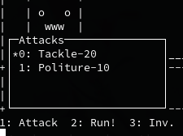

When you fight until the enemy Pokete's HP is low (like 1 to 3 HP), you can try to catch it. By pressing `3` you can open your inventory where you can choose from the items you have. By pressing `enter` you can use your chosen item. In the case of trying to catch the opposing Pokete, you should select the Poketeball.

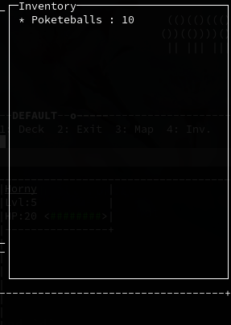

Catching a Pokete may not be successful on the first try.
You can also kill the Pokete and gain XP for your Pokete.

## Trainers
Trainers are other ten years old Pokete trainers just like you. They are the other `a`s you may encounter on the map. They will talk to you and then start a fight; the only difference between a trainer fight and a normal fight is that you cannot run away from a trainer fight and cannot catch the enemys' Pokete. They will give you $20 if you win.

## Inventory
By Pressing `4` you can open your inventory. This is  where you can see all of your items, their amounts, and how much money you have. By selecting an item with the cursor and pressing `enter` you can see the item's description. To exit, just press `Esc` or `q`.

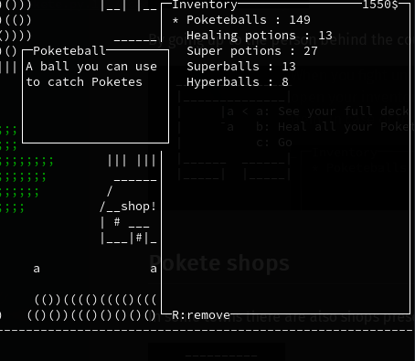

By having an item selected and pressing `r` you can remove it from your inventory.

## Minimap
By pressing `3` you can open a map of the complete Pokete world where you can see and select all Routes/Towns on the map. You can select and navigate by using `w`, `a`, `s` and `d`. To exit just press `Esc` or `q`.

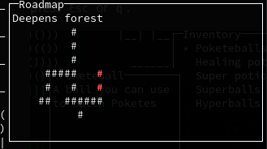

## Pokete centers
On your journey through the Pokete world you may discover the some houses. 

Some of those houses are Pokete centers where you can heal your wounded Poketes and reorganize your deck.

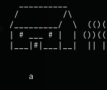

By going up to the person behind the counter you can interact with them. 

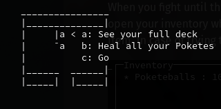

## Pokete shops
In some towns there are also shops present where you can by items like Potions and Poketeballs.

By going up to the person behind the counter you can interact with them. 

To by an item just navigate the cursor to it and press `enter`. The item will then be added to your inventory. To exit just press `Esc` or `q`.

## Poketeballs
Poketeballs are needed to catch Poketes. You can see how many Poketeballs you have in your Inventory, buy them in the [Pokete shop](#pokete-shops) and find them on the map.
They are the small red balls hidden all over the map, and can be collected by just walking over them.

## Settings
In the game's menu/settings you can change the players name, save, exit, or change other settings. To exit just press `Esc` or `q`.

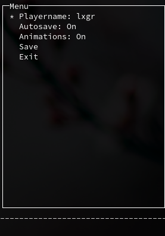

## Trading
When you're in the same network as another Pokete-player you can trade one of your Poketes for one of theirs.
In the Pokete-center stands another NPC, the trader, who you can talk to and start the trade.

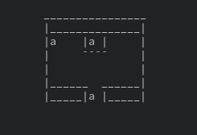

One of the two players must be the host while the other is the guest. The host has to start the trade first for it to work.

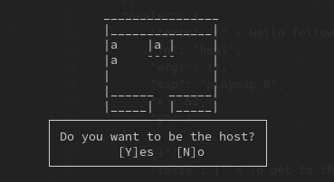

When prompted, the guest must type in the hostname of the host's computer displayed on the host's display.  
You may run into problems with firewalls.

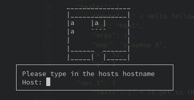

## Shiny Poketes
Shiny Poketes are rare to find (chance 1/500) and have 2 points more of attack, defense, and initiative as well as 5 HP more than normal. Their names are highlighted yellow. 

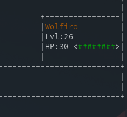

## Pokete-dex
The Pokete dex is made for the user to keep track of all Poketes they ever caught along with their stats. It does not list individual Poketes, but instead the Pokete 'race' itself. Poketes your never caught are shown with a "???".

It can be accessed by pressing 5 in the main game.

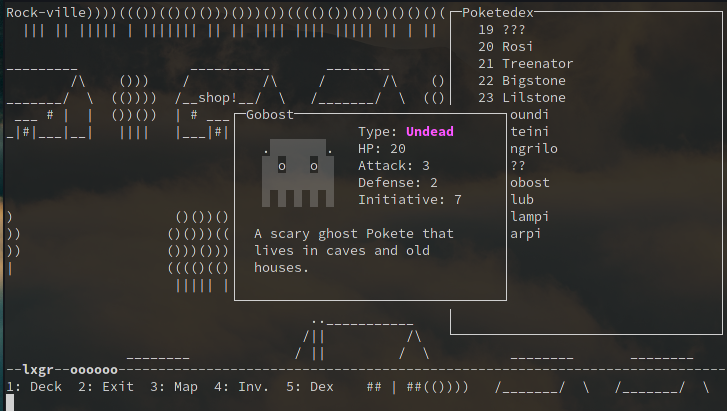

## Learning Attacks
Every fifth level, a Pokete will try to learn a new attack. If the number of attacks a Pokete has is already four, the player will be prompted to choose which attack will be replaced by the new one, otherwise it will just be added to the existing attacks.

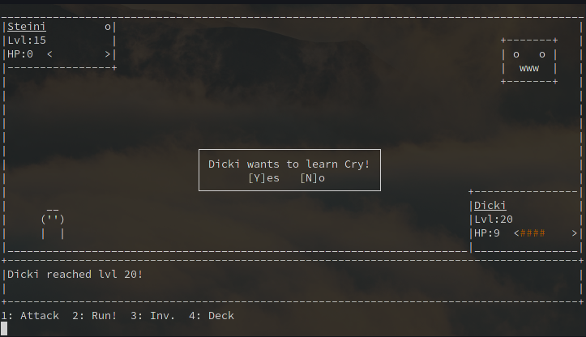

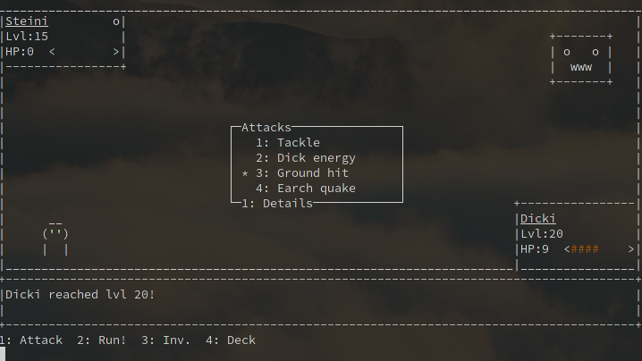

## Learning-Discs
LDs are DVD-like items you can find on the map which can be used to teach a special attack to a Pokete. They can only be used once!
