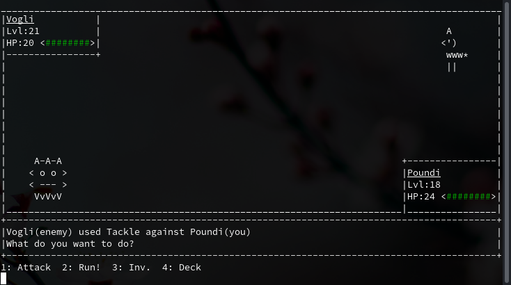

[](https://github.com/lxgr-linux/pokete/actions/workflows/main.yml)
[](https://github.com/lxgr-linux/pokete/actions/workflows/main_validate.yml)


<br>


# Pokete -- Grey Edition



[See more example pics](assets/pics.md)

## What is it?

Pokete is a small terminal based game in the style of a very popular and old game by Gamefreak.

## Installation

```shell
pip install pokete
```

You can also install it from the AUR:

```shell
$ buildaur -S pokete-git
```

Or you can just run the AppImage from the release page.

NOTE: In that case you first have to create the `~/.cache/pokete/` folder.

For Windows:

Some windows antivirus may flag the `libplaysound.dll` as malicious. If pokete crashes, please make sure that the .dll
exists and is **not** in quarantine!

To build a contained executable
```shell
pyinstaller --onefile src/pokete/__main__.py --name pokete --add-binary="src/pokete/playsound/libplaysound.x86_64.so:." --add-data="src/pokete/assets:pokete/assets"
```

If you have problems with your ARCH you maybe need to rebuild the audio module, see [here](playsound/README.md).

## Running locally

```shell
pip install scrap_engine
git clone https://github.com/lxgr-linux/pokete.git
cd pokete/src
python -m pokete
```

## Usage

The game can be run normally without supplying any options.
For non gameplay related usage, use `--help`.
Try it out [online](https://replit.com/@lxgr-linux/pokete).

## How to play

Imagine that you're a Pokete Trainer and you travel around the world to catch/train as many Poketes as possible with the
ultimate goal of becoming the best trainer.

First of all you get a starter Pokete (Steini), that you can use to fight battles with other Poketes.
Use W, A, S and D to move around.

When entering the high grass (;), you may be attacked by a wild Pokete. By pressing `1` you can choose between the
attacks your Pokete has (as long their AP is over 0). By pressing the according number, or navigating with the `*`
cursor to the attack and pressing `Enter` you can use the attack selected. The wild Pokete will fight back, but you can
kill it and gain XP to level up your Pokete. If you would like to catch a wild Pokete, you must first weaken it and then
throw a Poketeball. With a bit of luck, you can catch it and have it fight for you.

By pressing the `1` key, you can take a look at your current deck. You can see detailed information of your Pokete and
your attacks, or rearrange them.
Changes will only be saved by quitting the game using the exit function.

Since you're a Pokete Trainer, you can also fight against other trainers (they appear as an 'a'). He will start a fight
with you when you get close enough to him. You can not run from a trainer fight; you either have to win, or lose. These
trainer fights give double the XP.

When one of your Poketes is too weak or dies, you can heal it by going into the Pokete Center (the house), talk to the
person there and choose the healing option.
Here you can also take a look at all of your Poketes, and not just the six in your team. The ones marked with an `o` are
the ones in your deck.

By pressing `e`, a menu will appear where player name, and later other settings, can be changed.

The red balls all over the map are Poketeballs. You'll need these to catch Poketes. Stepping on such a ball will add it
to your inventory.

See [How to play](docs/HowToPlay.md).

## Game depth

Not only are there Poketes that are stronger than others, but also Poketes with different types, which are effective
against some types and ineffective against others.

| Type    | Effective against            | Ineffective against |
|---------|------------------------------|---------------------|
| Normal  |                              |                     |
| Stone   | Flying, Fire                 | Plant               |
| Plant   | Stone, Ground, Water         | Fire, Ice           |
| Water   | Stone, Flying, Fire          | Plant, Ice          |
| Fire    | Flying, Plant, Undead, Ice   | Stone, Water        |
| Ground  | Normal                       | Flying              |
| Electro | Stone, Flying                | Ground              |
| Flying  | Plant                        | Stone               |
| Undead  | Normal, Ground, Plant, Water | Fire                |
| Ice     | Water, Plant                 | Fire                |

For additional information you can see [wiki](docs/wiki.md) or
[the multi-page wiki](https://lxgr-linux.github.io/pokete/wiki-multi).

## Mods

Mods can be written to extend Pokete. To load a mod, the mod has to be placed in `mods` and mods have to be enabled in
the menu.
For an example mod see [example.py](mods/example.py).

## Tips

- When you want to see the next part of a conversation, press any key
- Don't play on full-screen; the game will not run properly
- Don't be offended by the other trainers; they may swear at you

## TODO

- [x] A wizard at the start to set name and starter Pokete
- [ ] More maps
- [x] Types for attacks and Poketes
- [x] Evolving
- [x] More than one Pokete for trainers
- [x] Coloured Poketes
- [x] A store to buy Poketeballs
- [x] Potions
- [x] Intro
- [x] Trading
- [x] Poketedex
- [x] Effects
- [x] Colour codes for types

## Dependencies

Pokete depends on python3 and the `scrap_engine` module.
On Windows `pynput` has to be installed too.

## Documentation

- [Documentation for pokete_classes](https://lxgr-linux.github.io/pokete/doc/pokete_classes/index.html)
- [Documentation for pokete_data](https://lxgr-linux.github.io/pokete/doc/pokete_data/index.html)
- [Documentation for the util file](https://lxgr-linux.github.io/pokete/doc/util.html)
- [Documentation for the pokete_general_use_fns](https://lxgr-linux.github.io/pokete/doc/pokete_general_use_fns.html "pokete_general_use_fns.py")
- [Documentation for the main file "pokete.py"](https://lxgr-linux.github.io/pokete/doc/pokete.html "pokete.py")

## Releases

For release information see [Changelog](Changelog.md).

## Contributing

Feel free to contribute whatever you want to this game.
New Pokete contributions are especially welcome, those are located in /pokete_data/poketes.py

To learn how to add more poketes/types/attacks to the game, see [the development guide](docs/DevGuide.md)

After adding new Poketes and/or attacks you may want to run

```shell
$ ./util.py wiki
```

to regenerate the wiki and adding them to it.

## Migrating to flatpak

If you're migrating to the flatpak release, move your `~/.local/share/pokete/pokete.json`
to `~/.var/app/com.github.lxgr_linux.pokete/data/pokete/pokete.json`.

## Credits

Music:

- Eric Skiff - Resistor Anthems - Available at [http://EricSkiff.com/music](http://EricSkiff.com/music)
- Marllon Silva (xDeviruchi) - 8-bit-fantasy-adventure-music-pack - Available
  at [itch.io](https://xdeviruchi.itch.io/8-bit-fantasy-adventure-music-pack)
- SketchyLogic - Map - Available
  at [opengameart.org](https://opengameart.org/content/nes-shooter-music-5-tracks-3-jingles)

## Troubleshooting

If you're experiencing problems on Japanese systems take a look
at [this](https://gist.github.com/z80oolong/c7523367b798bdda094f859342f4c8be).


## 🌐 Web Resources & Interactive Index
- [VEX TRY TO FLY](https://learnquester.pages.dev/vex-try-to-fly.html)
- [WATER SHOOTER](https://themindskillplayplay.pages.dev/water-shooter.html)
- [CATEGORY MATCH 3 2](https://learnquesters.pages.dev/category-match-3-2.html)
- [ARCHER DUNGEON HERO](https://studyplaying.github.io/archer-dungeon-hero.html)
- [ALIEN INTELLIGENCE TEST](https://themindskillplayplay.pages.dev/alien-intelligence-test.html)
- [AIR BLOCK](https://thequizzone.pages.dev/air-block.html)
- [CATEGORY LISTS](https://iskillquest.pages.dev/category-lists.html)
- [SNIPER 3D ZOMBIE](https://studyplayings.web.app/sniper-3d-zombie.html)
- [CATEGORY PHYSICS371](https://iskillquest.pages.dev/category-physics371.html)
- [TRIANGLE WAY](https://learnquester.pages.dev/triangle-way.html)
- [XMAS PRESENTS MAHJONG](https://theskillquest.pages.dev/xmas-presents-mahjong.html)
- [TAILOR STYLIST FASHION DIARY](https://studyplayings.web.app/tailor-stylist-fashion-diary.html)
- [PACKING LINE](https://studyplayings.web.app/packing-line.html)
- [ASMR BEAUTY SUPERSTAR](https://thelearnquesters.pages.dev/asmr-beauty-superstar.html)
- [CATEGORY DEEP IMMERSIVE24](https://studyplayings.pages.dev/category-deep-immersive24.html)
- [CATEGORY RACING DRIVING 3](https://theskillquest.pages.dev/category-racing-driving-3.html)
- [FLOOF MY PET HOUSE](https://iskillquest.pages.dev/floof-my-pet-house.html)
- [EGG DASH](https://studyplayings.web.app/egg-dash.html)
- [LITTLE CANDY BAKERY](https://skillplay.github.io/little-candy-bakery.html)
- [STACKTRIS 2048](https://thequizzone.pages.dev/stacktris-2048.html)
- [CATEGORY CASUAL 3](https://learnquester.pages.dev/category-casual-3.html)
- [CATEGORY RELAXING223](https://learnquester.pages.dev/category-relaxing223.html)
- [KITCHEN STAR](https://iskillquest.pages.dev/kitchen-star.html)
- [STEAL BRAINROT ORIGINAL 3D](https://themindskillplayplay.pages.dev/steal-brainrot-original-3d.html)
- [MEMOJI](https://themindskillplayplay.pages.dev/memoji.html)
- [JET FIGHTER AIRPLANE RACING](https://themindskillplayplay.pages.dev/jet-fighter-airplane-racing.html)
- [CATEGORY MINECRAFT](https://learnquester.pages.dev/category-minecraft.html)
- [CATEGORY 1 PLAYER139](https://iskillplay.web.app/category-1-player139.html)
- [BASKET CHAMPS](https://thequizzone.pages.dev/basket-champs.html)
- [CATEGORY PARTY23](https://thelearnquester.web.app/category-party23.html)
- [URBAN ASSAULT FORCE](https://thelearnquester.web.app/urban-assault-force.html)
- [TARCAT](https://thequizzone.pages.dev/tarcat.html)
- [EVONY THE KINGS RETURN](https://studyplayings.web.app/evony-the-kings-return.html)
- [CATEGORY BUBBLE SHOOTER27](https://iskillplay.web.app/category-bubble-shooter27.html)
- [CATEGORY PUZZLE 3](https://learnquester.pages.dev/category-puzzle-3.html)
- [FARM TRIPLE MATCH](https://thequizzone.pages.dev/farm-triple-match.html)
- [SNAKE CLASH](https://thequizzone.pages.dev/snake-clash.html)
- [CATEGORY 204828](https://themindskillplayplay.pages.dev/category-204828.html)
- [PUT THE FRUIT TOGETHER](https://theskillquest.pages.dev/put-the-fruit-together.html)
- [INDEX12](https://studyplayings.pages.dev/index12.html)
- [HIGH HEELS 2](https://thequizzone.pages.dev/high-heels-2.html)
- [CATEGORY COLLECT565](https://learnquester.pages.dev/category-collect565.html)
- [PIN BOARD PUZZLE](https://learnquester.pages.dev/pin-board-puzzle.html)
- [CRASH THE ROBOT](https://studyplayings.web.app/crash-the-robot.html)
- [CATEGORY COOKING](https://iskillplay.web.app/category-cooking.html)
- [GEOMETRY TOWER DEFENSE](https://themindskillplayplay.pages.dev/geometry-tower-defense.html)
- [UNSCREW THEM ALL](https://studyplayings.web.app/unscrew-them-all.html)
- [CATEGORY HORROR 2](https://themindplay.pages.dev/category-horror-2.html)
- [SIBERIAN ASSAULT](https://studyplayings.web.app/siberian-assault.html)
- [EAT DONUTS](https://themindskillplayplay.pages.dev/eat-donuts.html)
- [ASCENT](https://iskillplay.web.app/ascent.html)
- [CRAZY BAR BRAWL](https://skillplay.github.io/crazy-bar-brawl.html)
- [BOMBAMAN 3D](https://thelearnquesters.pages.dev/bombaman-3d.html)
- [TANK ATTACK 5](https://themindskillplayplay.pages.dev/tank-attack-5.html)
- [CATEGORY POOL](https://thelearnquester.web.app/category-pool.html)
- [INDEX37](https://themindplay.pages.dev/index37.html)
- [BIG BLOCK BLAST](https://themindskillplayplay.pages.dev/big-block-blast.html)
- [CATEGORY MOUSE1 697](https://thelearnquester.web.app/category-mouse1-697.html)
- [FOREST TILE MATCH](https://iskillplay.web.app/forest-tile-match.html)
- [METEOHEROES](https://iskillplay.web.app/meteoheroes.html)
- [SOLITAIRE MAHJONG](https://iskillplay.web.app/solitaire-mahjong.html)
- [CATEGORY PROXY](https://learnquester.pages.dev/category-proxy.html)
- [SUPER ELIP ADVENTURE](https://themindskillplayplay.pages.dev/super-elip-adventure.html)
- [BRAIN TEST IQ CHALLENGE 2](https://thequizzone.pages.dev/brain-test-iq-challenge-2.html)
- [CATEGORY SHOOTER 2](https://studyplayings.pages.dev/category-shooter-2.html)
- [ESCAPE AGAIN](https://studyplayings.web.app/escape-again.html)
- [BACKWOODS](https://learnquester.pages.dev/backwoods.html)
- [PLANETARIUM 2](https://thelearnquesters.pages.dev/planetarium-2.html)
- [MONEY MAN 3D](https://themindskillplayplay.pages.dev/money-man-3d.html)
- [NATURAL DISASTER SURVIVAL OBBY](https://themindskillplayplay.pages.dev/natural-disaster-survival-obby.html)
- [CATEGORY CAR376](https://iskillquest.pages.dev/category-car376.html)
- [DIGITAL CIRCUS FIND THE DIFFERENCES](https://theskillquest.pages.dev/digital-circus-find-the-differences.html)
- [CATEGORY FOOTBALL](https://themindskillplayplay.pages.dev/category-football.html)
- [INDEX7](https://studyplayings.pages.dev/index7.html)
- [BLOON POP](https://learnquester.pages.dev/bloon-pop.html)
- [CATEGORY MAHJONG37](https://iskillquest.pages.dev/category-mahjong37.html)
- [PLANTS WARFARE](https://thelearnquesters.pages.dev/plants-warfare.html)
- [CATEGORY PREMIUM PERKS74](https://thelearnquester.web.app/category-premium-perks74.html)
- [WOOP CRAWL UP](https://iskillquest.pages.dev/woop-crawl-up.html)
- [TRUE LOVE CALCULATOR NZW](https://themindskillplayplay.pages.dev/true-love-calculator-nzw.html)
- [IDLE LANDMARK BUILDER](https://learnquester.github.io/idle-landmark-builder.html)
- [INDEX8](https://learnquester.pages.dev/index8.html)
- [CATEGORY SHOOTER](https://thelearnquester.web.app/category-shooter.html)
- [STICK HERO BATTLE](https://learnquester.pages.dev/stick-hero-battle.html)
- [CATEGORY SANDBOX41](https://learnquester.pages.dev/category-sandbox41.html)
- [CATEGORY BOOKMARKLETS](https://learnquester.pages.dev/category-bookmarklets.html)
- [ACADEMY ASSAULT](https://skillplay.github.io/academy-assault.html)
- [BASKETBALL LIFE 3D](https://thelearnquesters.pages.dev/basketball-life-3d.html)
- [DARLING DOLL](https://thequizzone.pages.dev/darling-doll.html)
- [WORDS OR DIE](https://themindskillplayplay.pages.dev/words-or-die.html)
- [SAMURAI VS YAKUZA BEAT EM UP](https://themindskillplayplay.pages.dev/samurai-vs-yakuza-beat-em-up.html)
- [ESCAPE SCHOOL DUEL](https://themindskillplayplay.pages.dev/escape-school-duel.html)
- [INDEX5](https://studyplayings.pages.dev/index5.html)
- [CRAZY PLANE LANDING](https://thelearnquesters.pages.dev/crazy-plane-landing.html)
- [YOUTUBER MCRAFT 2PLAYER](https://skillplay.github.io/youtuber-mcraft-2player.html)
- [OVERTIDE IO](https://thelearnquester.web.app/overtide-io.html)
- [INDEX36](https://iskillplay.web.app/index36.html)
- [STICKMAN SHOOTER BROS](https://studyplayings.web.app/stickman-shooter-bros.html)
- [BLOCK PUZZLE 3D](https://skillplay.github.io/block-puzzle-3d.html)
- [INDEX21](https://learnquester.pages.dev/index21.html)
- [PUMPKIN CATCHER](https://studyplayings.web.app/pumpkin-catcher.html)
- [REAL DRIVING SIMULATOR](https://theskillquest.pages.dev/real-driving-simulator.html)
- [CHICKEN JUMP A TAP CHALLENGE](https://theskillquest.pages.dev/chicken-jump-a-tap-challenge.html)
- [CASTLE CRAFT](https://themindplay.pages.dev/castle-craft.html)
- [PRIVACY](https://studyplayings.pages.dev/privacy.html)
- [MIRACLE MAHJONG](https://thelearnquesters.pages.dev/miracle-mahjong.html)
- [CARS VS ZOMBIES](https://themindplay.github.io/cars-vs-zombies.html)
- [PRSINO](https://iskillquest.pages.dev/prsino.html)
- [CATEGORY SIMULATION 2](https://iskillquest.pages.dev/category-simulation-2.html)
- [MONSTER GIRLS BACK TO SCHOOL](https://thelearnquester.web.app/monster-girls-back-to-school.html)
- [INDEX14](https://learnquester.pages.dev/index14.html)
- [BACTERIA LIFE DEATH](https://studyplayings.web.app/bacteria-life-death.html)
- [CATEGORY LOVE12](https://studyplayings.pages.dev/category-love12.html)
- [EGGY BEATS](https://thequizzone.pages.dev/eggy-beats.html)
- [PLANTS VS ZOMBIES WAR](https://thequizzone.pages.dev/plants-vs-zombies-war.html)
- [CATEGORY ONE BUTTON84](https://studyplayings.pages.dev/category-one-button84.html)
- [CATEGORY OBSTACLE](https://thelearnquesters.pages.dev/category-obstacle.html)
- [CATEGORY DEFENSE176](https://iskillplay.web.app/category-defense176.html)
- [CATEGORY PLATFORM260](https://thelearnquester.web.app/category-platform260.html)
- [VORTEX BALL](https://studyplayings.web.app/vortex-ball.html)
- [CATEGORY PUZZLE 4](https://themindskillplayplay.pages.dev/category-puzzle-4.html)
- [CATEGORY MONSTER207](https://themindplay.github.io/category-monster207.html)
- [HIDDEN OBJECT EMILYS CASE](https://learnquester.github.io/hidden-object-emilys-case.html)
- [SKINFLUENCER BEAUTY ROUTINE](https://thelearnquester.web.app/skinfluencer-beauty-routine.html)
- [DRAW BRIDGE BRAIN GAME](https://thelearnquester.web.app/draw-bridge-brain-game.html)
- [WHEEL OF BINGO](https://thelearnquester.web.app/wheel-of-bingo.html)
- [FROM ZOMBIE TO GLAM A SPOOKY TRANSFORMATION](https://theskillquest.pages.dev/from-zombie-to-glam-a-spooky-transformation.html)
- [PUZZLE BLOCKS FILL IT COMPLETELY](https://iskillquest.pages.dev/puzzle-blocks-fill-it-completely.html)
- [CATEGORY PUZZLE 4](https://thelearnquester.web.app/category-puzzle-4.html)
- [CATEGORY HUB](https://learnquester.pages.dev/category-hub.html)
